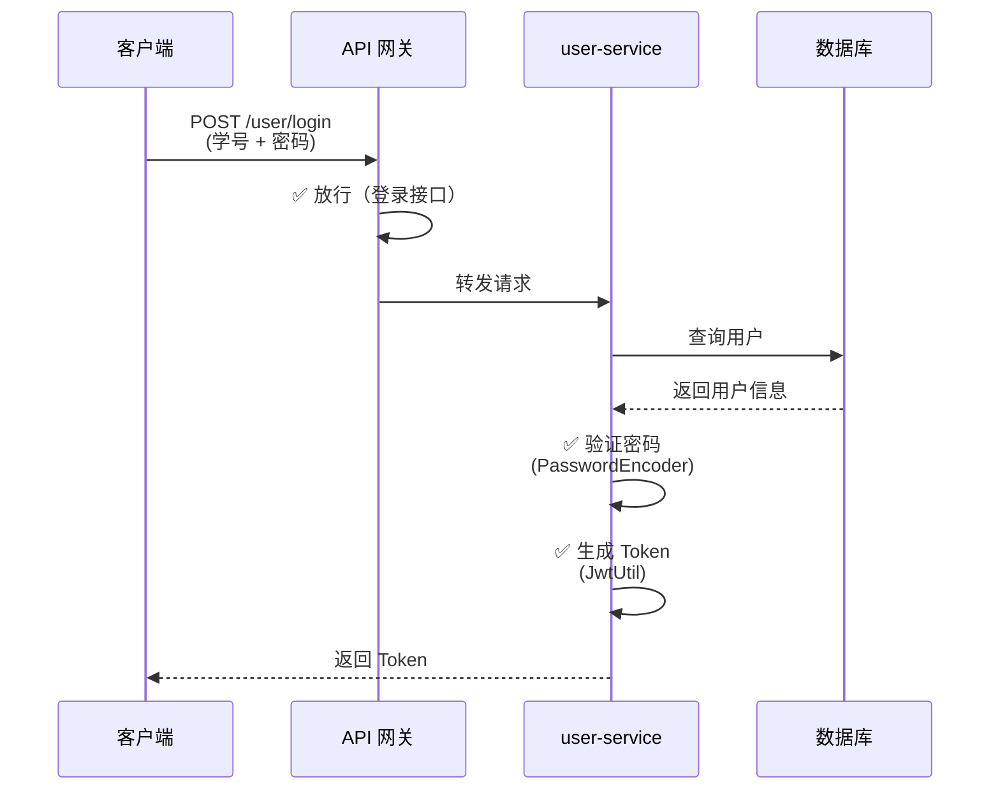
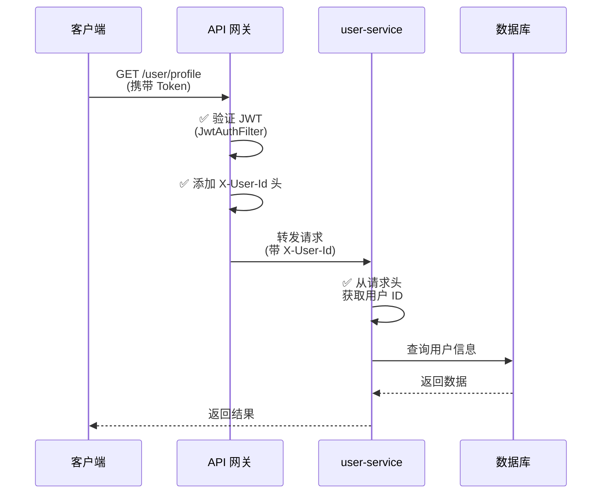

# 微服务认证架构说明

## 企业级最佳实践

### ✅ 当前架构：网关统一认证

```
┌─────────────────────────────────────────────────────┐
│              API Gateway (gateway-service)           │
│  端口：8080                                          │
│  ┌────────────────────────────────────────────┐     │
│  │ JwtAuthFilter (全局过滤器)                   │     │
│  │ ✅ JWT Token 验证                             │     │
│  │ ✅ 放行路径：/user/login, /user/register    │     │
│  │ ✅ 添加 X-User-Id 到请求头                    │     │
│  └────────────────────────────────────────────┘     │
└─────────────────────────────────────────────────────┘
                        │
        ┌───────────────┼───────────────┐
        ▼               ▼               ▼
┌──────────────┐ ┌──────────────┐ ┌──────────────┐
│ user-service │ │order-service │ │task-service  │
│ 端口：8081    │ │ 端口：8082    │ │ 端口：8083    │
│ ❌ 无 Security│ │ ❌ 无 Security│ │ ❌ 无 Security│
│ ✅ 从请求头   │ │ ✅ 从请求头   │ │ ✅ 从请求头   │
│ 获取用户 ID   │ │ 获取用户 ID   │ │ 获取用户 ID   │
└──────────────┘ └──────────────┘ └──────────────┘
```

---

## 📁 文件结构

### Gateway 服务

```
gateway/
├── pom.xml                          ✅ 配置依赖
│   ├── spring-cloud-starter-gateway
│   ├── spring-cloud-starter-alibaba-nacos-discovery
│   ├── spring-cloud-starter-alibaba-nacos-config
│   ├── jjwt-api (JWT)
│   └── common (引入 JwtUtil)
│
├── src/main/java/org/example/
│   ├── GatewayApplication.java      ✅ 启动类
│   └── config/
│       └── JwtAuthFilter.java       ✅ 全局 JWT 认证过滤器
│
└── src/main/resources/
    ├── application.yml              ✅ 路由规则、JWT 配置
    └── bootstrap.yml                ✅ Nacos 配置
```

### User-Service 服务

```
user-service/
├── pom.xml                          ✅ 配置依赖
│   ├── spring-boot-starter-web
│   ├── mybatis-plus-spring-boot3-starter
│   ├── jjwt-api (JWT)
│   ├── common (引入 JwtUtil)
│   └── ❌ 已移除 spring-boot-starter-security
│
├── src/main/java/org/example/
│   ├── UserServiceApplication.java  ✅ 启动类
│   ├── controller/
│   │   └── UserController.java      ✅ 登录、注册接口
│   ├── service/
│   │   ├── UserService.java
│   │   └── UserServiceImpl.java     ✅ 从请求头获取用户 ID
│   ├── entity/
│   │   └── User.java
│   ├── mapper/
│   │   └── UserMapper.java
│   └── dto/
│       ├── request/                 ✅ 登录、注册请求 DTO
│       └── response/                ✅ 响应 DTO
│
└── src/main/resources/
    └── application.yaml             ✅ 数据库、JWT 配置
```

---

## 🔄 认证流程

### 1. 登录流程（无需认证）



### 2. 访问受保护接口（需要认证）



---

## 📝 核心代码

### 1. Gateway - JwtAuthFilter.java

**位置**：`gateway/src/main/java/org/example/config/JwtAuthFilter.java`

**职责**：
- ✅ 全局 JWT 验证
- ✅ 放行登录、注册接口
- ✅ 将用户 ID 添加到请求头

**关键代码**：
```java
@Component
public class JwtAuthFilter implements GlobalFilter, Ordered {
    
    @Resource
    private JwtUtil jwtUtil;
    
    // 放行路径
    private static final List<String> SKIP_PATHS = Arrays.asList(
        "/user/login",
        "/user/register",
        "/actuator/health",
        "/favicon.ico"
    );
    
    @Override
    public Mono<Void> filter(ServerWebExchange exchange, GatewayFilterChain chain) {
        // 1. 检查是否放行路径
        if (isSkipPath(path)) {
            return chain.filter(exchange);
        }
        
        // 2. 解析 JWT Token
        String authHeader = request.getHeaders().getFirst(HttpHeaders.AUTHORIZATION);
        String token = authHeader.substring(7);
        Claims claims = jwtUtil.parseToken(token);
        Long userId = claims.get("userId", Long.class);
        
        // 3. 添加用户 ID 到请求头
        ServerHttpRequest mutatedRequest = request.mutate()
            .header("X-User-Id", String.valueOf(userId))
            .header("X-User-Token", token)
            .build();
        
        return chain.filter(exchange.mutate().request(mutatedRequest).build());
    }
}
```

### 2. User-Service - UserServiceImpl.java

**位置**：`user-service/src/main/java/org/example/service/impl/UserServiceImpl.java`

**职责**：
- ✅ 登录、注册业务逻辑
- ✅ 密码加密（PasswordEncoder）
- ✅ 生成 Token（JwtUtil）
- ✅ 从请求头获取用户 ID

**关键代码**：
```java
@Service
@Slf4j
public class UserServiceImpl implements UserService {
    
    @Resource
    private PasswordEncoder passwordEncoder;
    
    @Resource
    private JwtUtil jwtUtil;
    
    /**
     * 从请求头获取当前登录用户 ID
     * 网关认证后会将 userId 放入 X-User-Id 请求头
     */
    private Long getCurrentUserId() {
        ServletRequestAttributes attributes =
            (ServletRequestAttributes) RequestContextHolder.getRequestAttributes();
        HttpServletRequest request = attributes.getRequest();
        String userIdHeader = request.getHeader("X-User-Id");
        return Long.parseLong(userIdHeader);
    }
    
    @Override
    public Result profile() {
        Long userId = getCurrentUserId();  // ✅ 从请求头获取
        User user = userMapper.selectById(userId);
        return Result.success(...);
    }
}
```

---

## ⚠️ 注意事项

### 1. 依赖管理

**Gateway**：
```xml
<!-- ✅ 需要 -->
<dependency>
    <groupId>org.springframework.cloud</groupId>
    <artifactId>spring-cloud-starter-gateway</artifactId>
</dependency>
<dependency>
    <groupId>io.jsonwebtoken</groupId>
    <artifactId>jjwt-api</artifactId>
</dependency>

<!-- ❌ 不需要 -->
<dependency>
    <groupId>org.springframework.boot</groupId>
    <artifactId>spring-boot-starter-security</artifactId>
</dependency>
```

**User-Service**：
```xml
<!-- ✅ 需要 -->
<dependency>
    <groupId>org.springframework.security</groupId>
    <artifactId>spring-security-crypto</artifactId>
</dependency>
<dependency>
    <groupId>io.jsonwebtoken</groupId>
    <artifactId>jjwt-api</artifactId>
</dependency>

<!-- ❌ 移除 -->
<dependency>
    <groupId>org.springframework.boot</groupId>
    <artifactId>spring-boot-starter-security</artifactId>
</dependency>
```

### 2. 配置文件

**Gateway - application.yml**：
```yaml
server:
  port: 8080

spring:
  cloud:
    gateway:
      routes:
        - id: user-service
          uri: lb://user-service
          predicates:
            - Path=/user/**
```

**User-Service - application.yaml**：
```yaml
server:
  port: 8081

jwt:
  secret: campus-help-secret-key-for-jwt-token-2024
  expire: 604800000
```

### 3. 其他服务改造

所有下游服务（order-service, task-service 等）都需要：

1. **移除依赖**：
   ```xml
   <!-- ❌ 移除 -->
   <dependency>
       <groupId>org.springframework.boot</groupId>
       <artifactId>spring-boot-starter-security</artifactId>
   </dependency>
   ```

2. **删除配置**：
   - ❌ 删除 `SecurityConfig.java`
   - ❌ 删除 `JwtAuthenticationFilter.java`

3. **从请求头获取用户 ID**：
   ```java
   String userId = request.getHeader("X-User-Id");
   ```

---

## 📊 架构优势

| 特性 | 网关统一认证 | 各服务独立认证 |
|------|------------|--------------|
| **代码复用** | ✅ 一次编写，所有服务使用 | ❌ 每个服务都要写 |
| **性能** | ✅ JWT 只验证一次 | ❌ 每个服务都验证 |
| **维护成本** | ✅ 只需维护一处 | ❌ 多处维护 |
| **安全性** | ✅ 统一安全策略 | ❌ 容易不一致 |
| **服务简化** | ✅ 下游服务无 Security | ❌ 每个服务都有 Security |

---

## 🚀 启动顺序

1. **启动 Nacos**：`http://192.168.199.130:8848/nacos/`
2. **启动各微服务**：user-service, order-service, task-service 等
3. **启动网关**：gateway-service

---

## 🧪 测试用例

### 1. 测试登录（无需认证）

```bash
curl -X POST http://localhost:8080/user/login \
  -H "Content-Type: application/json" \
  -d '{
    "studentId": "2024001",
    "password": "123456"
  }'
```

**预期结果**：返回 Token

### 2. 测试受保护接口（需要认证）

```bash
curl -X GET http://localhost:8080/user/profile \
  -H "Authorization: Bearer <your_jwt_token>"
```

**预期结果**：返回用户信息

### 3. 测试未授权访问

```bash
curl -X GET http://localhost:8080/user/profile
```

**预期结果**：返回 401 未授权

---

## ✅ 总结

### Security 应该写在哪？

**答案**：写在**网关的全局过滤器**中（`JwtAuthFilter.java`），下游服务不需要配置 Security！

### 职责划分

| 组件 | 职责 | 不负责的职责 |
|------|------|-------------|
| **网关** | JWT 验证、路由转发 | 登录、注册、业务逻辑 |
| **User-Service** | 登录、注册、用户管理 | JWT 验证（由网关负责） |
| **其他服务** | 各自业务逻辑 | 认证相关 |

### 核心原则

1. **网关负责认证**：所有 JWT 验证在网关完成
2. **服务负责业务**：下游服务只处理业务逻辑
3. **职责分离**：认证和业务逻辑解耦
4. **统一管理**：安全策略在网关统一配置

这就是企业级微服务架构的最佳实践！✅
