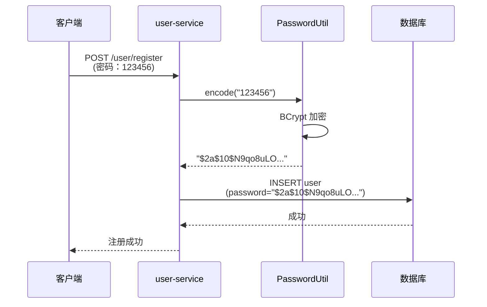
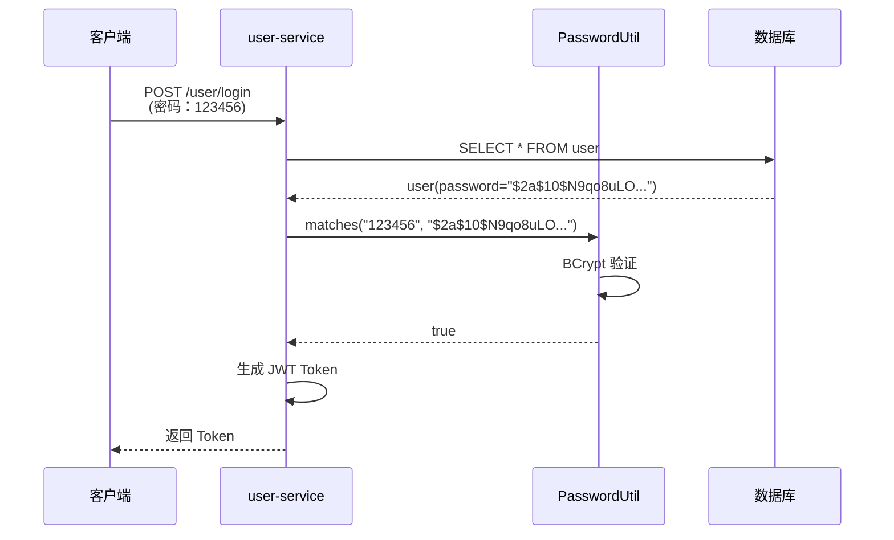

# 企业级密码处理方案

## 🔐 密码比对实现

### 当前实现（企业级标准 ✅）

**文件位置**：
- [UserServiceImpl.java](file://d:\gongju\code\AICursor\web\java\pre_goods\user-service\src\main\java\org\example\service\impl\UserServiceImpl.java) - 业务逻辑
- [PasswordUtil.java](file://d:\gongju\code\AICursor\web\java\pre_goods\user-service\src\main\java\org\example\util\PasswordUtil.java) - 密码工具类

### 核心代码

#### 1. 密码比对（登录）

```java
@Service
@Slf4j
public class UserServiceImpl implements UserService {
    
    @Resource
    private PasswordUtil passwordUtil;
    
    @Override
    public Result login(LoginRequest request) {
        // 1. 查询用户
        User dbUser = userMapper.selectByStudentId(request.getStudentId());
        if (dbUser == null) {
            return Result.error(2001, "学号或密码错误");
        }
        
        // 2. BCrypt 密码比对 ✅
        if (!passwordUtil.matches(request.getPassword(), dbUser.getPassword())) {
            return Result.error(2001, "学号或密码错误");
        }
        
        // 3. 生成 Token
        String token = jwtUtil.generateToken(dbUser.getId());
        return Result.success(...);
    }
}
```

#### 2. 密码加密（注册）

```java
@Override
public Result register(RegisterRequest request) {
    User user = new User();
    user.setStudentId(request.getStudentId());
    
    // BCrypt 加密密码 ✅
    user.setPassword(passwordUtil.encode(request.getPassword()));
    
    userMapper.insert(user);
    return Result.success(user.getId());
}
```

---

## 📋 企业级最佳实践

### 1. **使用 BCrypt 算法**

**为什么选择 BCrypt？**

| 特性 | BCrypt | MD5 | SHA-256 |
|------|--------|-----|---------|
| **加盐** | ✅ 自动 | ❌ 需要手动 | ❌ 需要手动 |
| **自适应** | ✅ 可调整强度 | ❌ 固定 | ❌ 固定 |
| **安全性** | ⭐⭐⭐⭐⭐ | ⭐ | ⭐⭐ |
| **推荐度** | ✅ 推荐 | ❌ 不推荐 | ⚠️ 一般 |

**BCrypt 工作原理**：
```
原始密码："123456"
↓
生成随机盐值（Salt）
↓
BCrypt 哈希（多轮迭代）
↓
加密结果："$2a$10$N9qo8uLOickgx2ZMRZoMyeIjZAgcfl7p92ldGxad68LJZdL17lhWy"
         ^^^ ^^^ ^^^^^^^^^^^^^^^^^^^^^^^^^^^^^^^^^^^^^^^^^^^^^^
         算法 强度 盐值 + 哈希结果
```

### 2. **密码工具类封装**

**PasswordUtil.java**：

```java
@Slf4j
@Component
public class PasswordUtil {
    
    private static final PasswordEncoder PASSWORD_ENCODER = 
        new BCryptPasswordEncoder();
    
    /**
     * 加密密码
     */
    public String encode(String rawPassword) {
        return PASSWORD_ENCODER.encode(rawPassword);
    }
    
    /**
     * 验证密码
     */
    public boolean matches(String rawPassword, String encodedPassword) {
        return PASSWORD_ENCODER.matches(rawPassword, encodedPassword);
    }
}
```

**优点**：
- ✅ 统一加密算法
- ✅ 便于后期升级
- ✅ 代码复用
- ✅ 易于测试

---

## 🔍 完整流程

### 注册流程



### 登录流程



---

## ⚙️ 配置说明

### 1. **Maven 依赖**

```xml
<dependencies>
    <!-- Spring Security Crypto (用于 BCrypt 密码加密) -->
    <dependency>
        <groupId>org.springframework.security</groupId>
        <artifactId>spring-security-crypto</artifactId>
        <version>6.2.0</version>
    </dependency>
</dependencies>
```

### 2. **数据库字段**

```sql
CREATE TABLE `user` (
    `id` bigint NOT NULL AUTO_INCREMENT,
    `student_id` varchar(50) NOT NULL,
    `password` varchar(255) NOT NULL,  -- BCrypt 加密结果，长度 255
    `nickname` varchar(100),
    ...
    PRIMARY KEY (`id`)
);
```

**注意**：
- ✅ `password` 字段长度至少 **60 字符**（推荐 255）
- ✅ BCrypt 加密结果格式：`$2a$10$...`（60 字符）

---

## 🛡️ 安全建议

### 1. **密码强度要求**

```java
/**
 * 验证密码强度
 * 企业级密码要求：
 * - 长度 8-20 位
 * - 包含大小写字母
 * - 包含数字
 * - 包含特殊字符
 */
public boolean validatePasswordStrength(String password) {
    if (password == null || password.length() < 8) {
        return false;
    }
    
    // 至少包含一个大写字母
    boolean hasUpper = password.matches(".*[A-Z].*");
    // 至少包含一个小写字母
    boolean hasLower = password.matches(".*[a-z].*");
    // 至少包含一个数字
    boolean hasDigit = password.matches(".*\\d.*");
    // 至少包含一个特殊字符
    boolean hasSpecial = password.matches(".*[!@#$%^&*].*");
    
    return hasUpper && hasLower && hasDigit && hasSpecial;
}
```

### 2. **密码加密日志**

```java
// ✅ 正确：不记录明文密码
log.info("用户登录，学号：{}", request.getStudentId());

// ❌ 错误：不要记录密码
log.info("密码：{}", request.getPassword());  // 禁止！
```

### 3. **错误提示**

```java
// ✅ 推荐：模糊错误信息
return Result.error(2001, "学号或密码错误");

// ❌ 不推荐：明确提示
if (dbUser == null) {
    return Result.error(2001, "学号不存在");  // 泄露信息
}
if (!passwordUtil.matches(...)) {
    return Result.error(2001, "密码错误");  // 泄露信息
}
```

---

## 📊 加密算法对比

| 算法 | 安全性 | 性能 | 推荐场景 |
|------|--------|------|---------|
| **BCrypt** | ⭐⭐⭐⭐⭐ | 中等 | ✅ 用户密码（推荐） |
| **Argon2** | ⭐⭐⭐⭐⭐ | 较慢 | ✅ 高安全场景 |
| **PBKDF2** | ⭐⭐⭐⭐ | 慢 | ✅ 企业应用 |
| **SHA-256** | ⭐⭐ | 快 | ❌ 不推荐用于密码 |
| **MD5** | ⭐ | 很快 | ❌ 已淘汰 |

---

## 🔧 常见问题

### Q1: 为什么不用 MD5？

**A**: MD5 已被证明不安全，容易被彩虹表破解。BCrypt 自动加盐且计算慢，适合密码存储。

### Q2: BCrypt 加密结果为什么每次都不一样？

**A**: BCrypt 每次都会生成随机盐值，所以即使相同密码，加密结果也不同。这是正常且安全的。

### Q3: 如何迁移旧系统的 MD5 密码？

**A**: 
```java
// 首次登录时升级加密算法
if (user.getPassword().startsWith("$2a$")) {
    // BCrypt 密码，直接验证
    if (passwordUtil.matches(rawPassword, user.getPassword())) {
        // 登录成功
    }
} else {
    // 旧 MD5 密码，验证后升级
    if (md5(rawPassword).equals(user.getPassword())) {
        // 升级为 BCrypt
        user.setPassword(passwordUtil.encode(rawPassword));
        userMapper.updateById(user);
    }
}
```

### Q4: BCrypt 的强度参数如何设置？

**A**: 
```java
// 默认强度 10（推荐）
new BCryptPasswordEncoder();

// 更高强度 12（更安全，但更慢）
new BCryptPasswordEncoder(12);

// 低强度 8（更快，但安全性降低）
new BCryptPasswordEncoder(8);
```

---

## ✅ 总结

### 企业级密码处理要点

1. ✅ **使用 BCrypt 算法** - 自动加盐，安全性高
2. ✅ **封装工具类** - PasswordUtil，便于维护
3. ✅ **统一加密存储** - 数据库中存储加密结果
4. ✅ **比对不比对原文** - 使用 `matches()` 方法
5. ✅ **不记录密码日志** - 保护用户隐私
6. ✅ **模糊错误提示** - 防止信息泄露

### 当前实现状态

- ✅ [PasswordUtil.java](file://d:\gongju\code\AICursor\web\java\pre_goods\user-service\src\main\java\org\example\util\PasswordUtil.java) - 密码工具类
- ✅ [UserServiceImpl.java](file://d:\gongju\code\AICursor\web\java\pre_goods\user-service\src\main\java\org\example\service\impl\UserServiceImpl.java) - 正确使用 BCrypt
- ✅ [pom.xml](file://d:\gongju\code\AICursor\web\java\pre_goods\user-service\pom.xml) - 已添加 spring-security-crypto 依赖

**这就是企业级的密码比对方案！** 🎉
